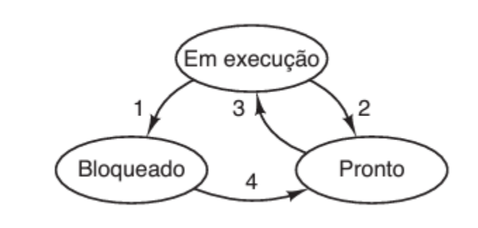

# Meu Material Didático de Sistemas Operacionais

## Introdução

Em um sistema computacional, o software atua como intermediário entre a camada do hardware e as aplicações. O processador, a memória e os dispositivos de E/S são interligados por meio de um único barramento.
O barramento de Von Neumann é responsável por transmitir dados, endereços e sinais de controle. O software é dividido em aplicações, que representam o propósito final, e a camada intermediária entre o hardware e o software, que é o sistema operacional.  
O sistema operacional tem a função de gerenciar os recursos do sistema. Sua primeira tarefa é compartilhar esses recursos entre as aplicações que estão em execução, o que pode ocorrer de duas maneiras: compartilhamento no espaço e no tempo.

No que se refere à memória, o compartilhamento ocorre no espaço. O sistema operacional decide em quais áreas de memória os aplicativos que desejamos executar serão alocados, garantindo que cada aplicação seja alocada em locais distintos.  
No caso da CPU, o compartilhamento ocorre no tempo. O sistema operacional coloca em execução um programa ou outro aplicativo e, em seguida, a CPU pode retornar ao programa que estava em execução antes do programa atual, ou seja, aquele que ganhou a CPU.

Outra função crucial do sistema operacional é impedir que uma aplicação leia ou escreva em uma área de memória destinada a outra aplicação em execução. Para garantir a proteção desses dados, o sistema operacional precisa implementar mecanismos de segurança. Geralmente, isso é realizado em nível de hardware, mas o sistema operacional deve programá-lo de maneira que a proteção dos dados seja efetiva durante a execução dos programas.  
Além disso, o sistema operacional deve proteger os dispositivos de entrada e saída.  
Cada dispositivo de E/S possui uma controladora, e é o sistema operacional que controla o software que é executado na CPU dessas controladoras. Isso é feito de forma protegida para evitar que uma aplicação interfira na outra ao escrever nessas controladoras.

Uma das responsabilidades do sistema operacional é estender a interface de programação por meio de abstrações e operações nessas abstrações.  
As principais abstrações do sistema operacional são os arquivos e os processos, que facilitam o desenvolvimento de aplicações e que as aplicações interajam com o hardware de forma simplificada.  
Os processos controlam a execução dos programas, enquanto os arquivos permitem o acesso aos dispositivos e operações de entrada e saída de dados.  
As operações que implementam essas abstrações são chamadas de chamadas de sistema (System Call).

O hardware possui uma interface de programação específica, que consiste em um conjunto de instruções de máquina da arquitetura do processador em uso. Por outro lado, o sistema operacional fornece uma API de nível mais alto, conhecida como conjunto de chamadas de sistema do sistema operacional.

O software desenvolvido na camada de aplicações utiliza interfaces com abstrações de nível mais alto, como os arquivos e os processos, em vez de utilizar a interface de baixo nível. Essas abstrações são implementadas por meio das chamadas de sistema. Uma chamada de sistema é um mecanismo pelo qual um programa de computador solicita um serviço do núcleo do sistema operacional em que está sendo executado. Isso pode incluir serviços relacionados ao hardware, criação e execução de novos processos e comunicação com os serviços do núcleo de maneira integral.

## Como funciona a execução de um sistema computacional 

Ao ligar o sistema computacional, a primeira coisa a ser executada é um programa embutido no hardware, que é a BIOS, responsável por realizar um diagnóstico do hardware. O PC (Program Counter), que é um registrador que indica qual será a próxima instrução a ser executada, aponta para o software ou programa armazenado no firmware (BIOS). A BIOS realiza uma verificação do hardware e carrega um programa chamado de bootloader. O bootloader, por sua vez, é responsável por carregar o sistema operacional do disco para a memória.

Em seguida, o PC passa a apontar para as instruções desse sistema operacional, dando início à execução do código do sistema operacional. O sistema operacional realiza algumas verificações adicionais e, em seguida, inicia a execução de aplicativos que funcionam como serviços do sistema operacional. Dessa forma, o sistema operacional está pronto para executar as aplicações do usuário.  
Para executar uma aplicação, como um navegador, uma parte dela é carregada do disco para a memória e o PC começa a apontar para esse código. Assim, quando o sistema operacional modifica o valor do PC, o navegador passa a ser executado em vez do sistema operacional, permitindo que a aplicação seja executada.

## Temporizador (Timer)

O temporizador é um hardware programável, no qual o sistema operacional programa intervalos de tempo bem definidos para gerar interrupções. Esse temporizador está conectado ao barramento e envia um sinal de interrupção para o barramento de controle, que é recebido pela CPU e tratado pelo controlador de interrupção programável (PIC).  
Quando a interrupção chega ao controlador de interrupção programável (PIC), o primeiro passo é aguardar que a CPU termine a execução da instrução em andamento. Em seguida, o PIC direciona o apontador do PC (Program Counter) para um código armazenado em uma área de memória do sistema operacional conhecida como vetor de interrupções.

O vetor de interrupções, localizado na memória do sistema operacional, contém endereços de rotinas específicas que tratam interrupções. Quando ocorre uma interrupção, o PIC espera a conclusão da instrução atual e, em seguida, faz com que o apontador de pilha aponte para a pilha do sistema operacional. Em seguida, o PC é direcionado para o endereço contido no vetor de interrupção correspondente à interrupção do temporizador, executando assim o código do sistema operacional responsável por tratar a interrupção do temporizador.

Dessa forma, o código do sistema operacional que lida com as interrupções de tempo de execução é executado. Isso garante que, após ceder a CPU para uma aplicação, periodicamente a CPU seja devolvida ao sistema operacional. Isso permite que o sistema operacional interrompa a execução de um programa e volte a executar outro, evitando assim a monopolização por um único programa.  
Consequentemente, outros programas têm a oportunidade de usar a CPU, assegurando que o sistema operacional obtenha a CPU em intervalos regulares para executar outras aplicações, ou que a aplicação atual continue a ter acesso à CPU.

## Interrupção e Exceção

Quando executamos instruções no modo núcleo podemos executar todas as instruções que o hardware prover. E quando a CPU está rodando no modo usuário, só podemos rodar um subconjunto dessas instruções. 
Se um programa no modo usuário tentar executar algo fora da faixa permitida por ele ocorrerá uma exceção. Ou seja, a unidade central de processamento irá gerar uma exceção. E uma exceção acontece sempre que uma instrução não pode ser completada.  
A unidade de controle começa a executar uma instrução e a primeira coisa que ela verifica (no PSW) é se a máquina está no modo usuário ou modo núcleo.  
Se a máquina estiver no modo usuário, ela verifica se a instrução que está sendo executada é uma instrução que pode ser executada com privilégio de usuário. Se isso não for o caso é gerada uma exceção.  
A exceção é tratada similar a interrupção mas não podemos completar a instrução (na interrupção deve-se completar a instrução) porque foi justamente um problema na execução da instrução que gerou a exceção.  
Da mesma forma que a interrupção a CPU vai fazer com que o SetPointer (SP) aponte para a pilha do núcleo, e que o PC aponte para o endereço da rotina de tratamento dessa exceção e ocorre que o sistema operacional que o programa estava executando, estava executando algo que não poderia executar e consequentemente, irá abortar a execução desse programa.

Quando um programa do usuário quer executar algo privilegiado ele pede ajuda do sistema operacional e ele não pode fazer uma chamada de função para o PC apontar para a próxima instrução, como para um read, ou seja, um set point para a pilha do sistema operacional porque se o modo usuário chamar o sistema operacional para executar no modo usuário, essas instruções do sistema operacional do read irá gerar exceções.  
A melhor forma de fazer isso é gerando exceções de forma controlada, e para todo conjunto de instruções de processadores, existe uma instrução especial chamada de Trap que sinaliza que a aplicação do usuário precisa executar algo em modo privilegiado (System Call).  
Quando por exemplo o Read do usuário é chamado, executa-se a trap que está dentro do read dele e esse trap irá gerar uma exceção. E assim, a máquina passa automaticamente para o modo núcleo onde qualquer coisa pode ser executada.  
Se os parâmetros forem adequados o programa é redirecionado para o system calls adequado por exemplo o read e comeco a executar o código com o modo de privilégio núcleo.  
Ou seja, se quisermos executar algo que é privilegiado, precisa-se executar uma Trap para que a máquina libere o modo núcleo  para que possa ser executado.

## Processos

O sistema operacional cria um processo para cada instância de uma aplicação que está em execução. Essa estrutura de dados, chamada de processo, armazena o identificador da instância de execução da aplicação, o estado do processo e os valores de todos os registradores da CPU que estavam em uso antes do programa ser interrompido.  
Dessa forma, quando um processo que perdeu a CPU retoma o seu funcionamento, ele terá todas as informações necessárias salvas para continuar a execução.

## Estados de um Processo

 

Um processo pode estar em três estados: em rodando, bloqueado e pronto para rodar. Quando um processo é criado, ele é colocado no estado "pronto para rodar". Assim que a CPU fica disponível, o processo é movido para o estado "rodando".  
Se um processo em execução faz uma chamada ao sistema, ele entra no estado "bloqueado". Isso ocorre quando há operações de entrada e saída que requerem um tempo significativo para serem concluídas, como a leitura de disco. Nesse caso, o processo é bloqueado por outro processo até que a operação de entrada e saída seja finalizada.  
Quando a fatia de tempo designada para a execução de um processo acaba, ele passa do estado "rodando" para o estado "pronto para rodar". Em seguida, outro processo que estava "pronto para rodar" é movido para o estado "rodando".

Um processo no estado "bloqueado" retorna para o estado "pronto para ser executado" assim que o evento pelo qual estava aguardando ocorre. Por exemplo, se um processo estava bloqueado aguardando a leitura do disco, o sistema operacional é notificado quando o controlador do disco interrompe a CPU para informar que a operação foi concluída. Nesse momento, o sistema operacional retoma a CPU e o processo que estava bloqueado é movido para o estado "pronto para rodar".  
Quando ocorre uma interrupção, a CPU finaliza a execução da instrução atual e passa a executar o tratador de interrupção correspondente a interrupção gerada. Por exemplo, se ocorrer uma interrupção de disco, o tratador de interrupção de disco será executado.  
Esse tratador realiza operações de entrada e saída no disco e verifica se existem processos bloqueados aguardando o término da operação. Se houver, esses processos bloqueados são movidos para o estado "pronto para rodar".  
Essas transições de estado são realizadas pelo sistema operacional, que manipula as estruturas de dados e altera o estado dos processos. Além disso, o sistema operacional só é executado quando ocorre uma interrupção ou exceção.

Assim, podemos descrever os seguintes estados:

De "Rodando" para "Pronto para Rodar":  
Esse estado ocorre quando a fatia de tempo designada para a execução de um processo chega ao fim, o que é indicado pelo temporizador. Quando o sistema operacional trata essa interrupção do temporizador, ele identifica que a fatia de tempo daquele processo foi encerrada. Em seguida, ocorre a transição de estado e o sistema operacional chama o escalonador de processos para selecionar qual processo, dentre aqueles prontos para rodar, ganhará a CPU.  
É importante observar que esse procedimento envolve a preservação das informações dos registradores no processo que está deixando a CPU e a restauração dessas informações do processo que irá ganhar a CPU. O último registrador a ser restaurado é o PC, que indica a próxima instrução a ser executada. Ao restaurar o PC, o controle efetivo da CPU é transferido para o novo processo.

De "Rodando" para "Bloqueado":  
Esse estado ocorre sempre que um processo realiza uma chamada ao sistema bloqueante. A chamada ao sistema é implementada por meio de uma exceção, que é gerada quando o processo executa uma instrução para a qual não possui privilégios e ao executar essa instrução sem privilégio, irá gerar uma exceção na unidade central de processamento. Essas exceções são tratadas de maneira semelhante às interrupções, ou seja, o PC passa a apontar para um código do sistema operacional responsável por tratar essa exceção, que, nesse caso, é a chamada ao sistema.  
A chamada ao sistema é executada e o código do sistema operacional associado a essa chamada identifica que o processo não pode prosseguir e precisa esperar por um evento. Dessa forma, o processo é movido para o estado "bloqueado", e as informações sobre o evento que ele está aguardando são armazenadas. Em seguida, o escalonador é chamado novamente para selecionar um novo processo "pronto para rodar", que será movido para o estado "rodando".

De "Bloqueado" para "Pronto para Rodar":  
Essa transição ocorre quando há uma interrupção vinda de um dispositivo que sinaliza a ocorrência de um evento. Além disso, também pode ocorrer por meio de uma chamada ao sistema executada pelo processo que está "rodando".  
Quando uma interrupção de dispositivo ocorre, o código do sistema operacional responsável por tratá-la é acionado. Esse código realiza operações de entrada e saída relacionadas ao dispositivo e verifica se existem processos bloqueados aguardando o término da operação. Se houver, esses processos bloqueados são movidos para o estado "pronto para rodar". Essa transição também pode ocorrer quando um processo em estado "bloqueado" realiza uma chamada ao sistema específica.  
Essas transições de estado são controladas pelo sistema operacional, que manipula as estruturas de dados e atualiza o estado dos processos de acordo com as condições e eventos ocorridos. Além disso, o sistema operacional é executado apenas em caso de interrupção ou exceção.

Finalmente,  
A transição de "Rodando" para "Pronto para Rodar" ocorre sempre que uma interrupção de relógio é gerada.  
A transição de "Pronto para Rodar" para "Em Execução" ocorre tanto devido à transição de "Rodando" para "Bloqueado" quanto devido à transição de "Rodando" para "Bloqueado".  
A transição de "Rodando" para "Bloqueado" ocorre devido a uma chamada de sistema (System Call).  
A transição de "Bloqueado" para "Pronto para Rodar" ocorre por meio de uma interrupção ou de uma chamada de sistema (System Call).  

## Escalonamento de Round Robin 

Quando o processo que estava rodando bloqueia ou quando a fatia de tempo dele acaba, o processo passa para o estado pronto para rodar. Assim eu preciso escolher um novo processo para ganhar a CPU. Um pedaço da CPU que faz essa decisão é o escalonador, e um dos escalonadores mais populares é o escalonador Round Robin.  
A ideia do escalonamento Round Robin é tentar ser justo com todos os processos. A ideia é que todos os processos que estão ativos vão ganhar uma fração da CPU que é mais ou menos a mesma, pelo menos durante o tempo em que aqueles processos estão coexistindo no sistema.  
Para fazer isso, esse algoritmo usa uma estrutura de dados extremamente simples. Usa-se uma fila onde o processo que está na cabeça da fila é o processo que está rodando e todos os processos em sequência são os processos que estão prontos para rodar. E esses processos vão rodar nessa ordem, ou seja, quando a fatia de tempo do processo que está rodando acaba ou ele perde a CPU. Se a fatia de tempo dele acabar e ele continuar pronto para rodar, ele vai para o fim da fila e o próximo processo ganha a CPU.  
Cada processo aponta para o próximo processo a ser executado depois dele e cada processo mapeia na tabela de processos a sua instrução a ser executada.  
Além disso, existe um apontador que aponta para a cabeça de um processo. Quando um processo acaba, ela aponta para o próximo processo que estava sendo apontado por quem executou por último. Ou seja, um processo aponta para outro processo e esse outro será apontado pelo apontador de processos, como se fosse uma LinkedList onde temos um head que aponta para a cabeça do nó em execução.  
Além disso, o último processo da fila precisa apontar para o primeiro processo a ser executado (que está executando), e assim os processos ficam de forma circular na fila.

Existem outras formas no sistema que vão impactar a forma sobre como eu atualizo essa minha lista (fila).  
Por exemplo, digamos que o processo 1 esteja executando e antes da fatia de tempo do processo 1 acabar, o processo 1 faz um chamada ao sistema que o bloqueia, e que faz com o programa 1 passe do estado rodando para bloqueado.  
No estado bloqueado, o programa 1 não consegue ganhar a CPU porque ele está esperando um evento e ele não consegue executar a próxima instrução do seu código até que o evento pelo qual ele está esperando ocorra. Portanto, eu preciso retirar o processo 1 dessa fila que é o processo que está bloqueado.  
Eu sei que a cabeça está apontando para o processo 1, eu elimino o processo para qual a cabeça aponta que é o processo 1 e passo para a cabeça apontar para o processo pelo qual o programa 1 apontava. E faz-se o último processo da fila (tail) apontar para a nova cabeça que será quem o processo será executado e isso é o evento rodando para o bloqueado.

Quando um processo é criado, o pai dele está rodando, pois o pai dele é quem está executando o System Call que vai criar aquele processo semelhante ao pai (que é o processo criado que estamos falando), só que esse processo vai estar no estado pronto para rodar e ele vai ser colocado no fim dessa fila.

O estado que é bloqueado fica pronto para rodar quando o evento que um processo estava bloqueado aconteça, ou seja, o processo bloqueado está esperando por determinado evento e o evento acontece. Quando o evento acontece, o processo que estava bloqueado passa para o estado pronto para rodar e ele precisa ser incluído na fila novamente. Ou seja, quando sai de rodando para bloqueado ele sai da fila e quando ele sai de bloqueado para pronto para rodar ele volta para a fila.  
O processo quando sai de bloqueado para pronto para rodar deve voltar a fila, mas ele não vai para o fim da fila e a razão para isso é que o tempo que esse processo passou bloqueado pode ser muito grande, sobretudo comparando com o tempo de uma fatia. Alguns processos desse passam por algumas dezenas de milissegundos executando e se um processo bloqueou por alguns segundos, os processos que estavam prontos para rodar executaram dezenas ou até centenas de vezes antes que esse processo que estava bloqueado pudesse ser executado pois estava bloqueado. Enquanto esse processo estava bloqueado, outros processos executaram varias vezes enquanto ele aguardava e seria injusto coloca-lo no fim da fila.  
E assim, é importante dar uma prioridade para esse processo que passou de bloqueado para pronto para rodar, e para o nosso exemplo anterior, o processo 1 que foi bloqueado voltaria para a fila, mas para o segundo colocado na fila enquanto o primeiro lugar seria quem ainda está rodando, e o segundo processo daria espaço para entrar o processo que passou de bloqueado para pronto para rodar, sendo assim, o terceiro processo seria colocado em terceiro lugar a ser executado para poder dar espaço para esse processo poder ficar no segundo lugar da nossa fila.  
As empresas usam round-robin ou variações dele para fazer escalonamento.

## Criação de processos

Quando temos um processo que executa um programa shell, o shell escreve na tela o prompt e lê o que o usuário digita no teclado.  
Quando o usuário escreve “ls” e tecla enter, a linha é passada para o shell que interpreta essa linha e o shell cria um novo processo que vai executar o programa /bin/ls que vai listar os nomes dos arquivos do diretório corrente no terminal. Quando o ls morre, o shell volta a executar, coloca novamente o prompt e fica esperando para o próximo comando. 

### Como o shell cria esse processo?

Os processos estão armazenados na tabela de processos, essa tabela de processos contém informações na memória sobre quem é o processo, qual o estado do processo, quais são os valores dos registradores daquele processo na última vez que ele executou para que eu possa retomar a execução do processo de onde ele parou, etc.  
Além disso, na memória, o processo ocupa uma determinada área da memória. Nessa área de memória, temos a imagem de um processo e ela é formada por quatro pedaços que são o código, os dados estáticos, o heap e a pilha.  
Quando um processo quer criar um outro processo, ela terá que criar uma entrada na tabela de processos para armazenar as informações do novo processo, inicializar essa estrutura de dados processos com os dados adequados e criar uma nova imagem para esse novo processo que vai ser criado e isso é feito via chamada ao sistema.  
Nos sistemas da família UNIX essa chamada ao sistema se chama FORK, que significa encruzilhada do inglês.  
A ideia é que tenha um processo tenha um fluxo de execução até que ele chame o System Call FORK, e aí nesse ponto a gente passa a ter dois processos executando, o pai e o filho. A diferença é que no pai do System Call FORK retorna o identificador do filho, enquanto que no filho do System Call retorna zero. 

No processo 1, eu tenho o código fonte, os dados e a pilha. E em algum lugar do código fonte do processo 1 eu tenho uma chamada para FORK. Quando o programa 1 chama o FORK, irá ocorrer um System Call e será gerado uma exceção, o PC(Program Counter) da CPU que estava apontando para uma área do processo do processo 1 passará a apontar para uma área sistema operacional que tem o código do System Call FORK. 

A execução desse código aloca na tabela de processos uma entrada que esteja livre.  
Digamos que o P1 (processo 1) esteja ocupando a entrada Processo#1 e que a entrada Processo#3 esteja vazia, então o Fork aloca essa entrada 3 para ser o lugar onde a gente vai guardar informações do processo P1’ que é o filho de P1 e P1’ será criado semelhante ao pai.  
Então, o FORK aloca uma área de memória que seja pelo menos do mesmo tamanho que a área de memória onde o pai está executando. Fazemos uma cópia do pai na memória.  
P1’ será exatamente o mesmo código do pai P1, uma cópia dos dados do pai, uma cópia da pilha do pai e termos uma chamada Fork em P1’ também.  
O Fork do pai retorna o identificador do filho enquanto que o filho vai retornar o zero.  
O ID do filho é o ID do pai até que faça ele pegar o ID dele mesmo.

# Threads

Em um exemplo de Threads, acontece quando vários clientes mandam uma requisição, o dispatch recebe essas requisições, ler para verificar o tipo de requisição e repassa para ser executado por outra entidade, o dispatch executa várias tarefas de forma independente e essas tarefas não precisa ser serializadas, ou seja, numa determinada ordem e pode executadas requisições em paralelo. 

O dispatch era um listener, antes era um processo que esperava o trabalho dos clientes, esperava até chegar uma requisição dos clientes e quando a requisição chegava, o listener realizava o FORK para atender cada uma das requisições. Cada requisição era atendido por um flho do dispatcher, ou seja, ele cria vários filhos igual ao dispatch, que ia executar o código necessário para processar essa requisição para atender o cliente.  
As threads funcionam da mesma forma.  
Entretanto, o FORK usava múltiplos processos para implementar essa solução, FORK é uma chamada ao sistema cara para executar, quando cria um filho a partir de um processo, esse filho tem a mesma memória do pai, ele é uma cópia do pai, essa memória precisa ser copiada e isso custa caro.  
Se os filhos de um processo precisa se comunicar com entre eles ou com o processo pai, a gente precisa implementar alguma forma de comunicação entre os processos, uma vez que os filhos por padrão não compartilham memória, cada um tem sua própria memória.  
A abstração Thread vem para nos salvar, uma Thread é uma alternativa para esse mesmo problema de dispatch. Então, uma Thread é uma unidade escalonada, tal como o processo, ou seja, o escalonador pode decidir quem vai executar. E cada Thread é um fluxo de execução, tal como é um processo, é uma sequência de instruções que vão ser executadas na máquina. As Threads são partes mais ou menos independentes de uma aplicação maior.  
As vantagens das Threads em comparação a múltiplos processos é que as Threads são menos caras de criadas, pois elas compartilham a memória do pai, a gente não precisa copiar a memória do pai quando criamos uma Thread nova.  
Por isso, para compartilhar a memória do pai é mais fácil programar com Threads, inclusive, arquitetar uma aplicação com múltiplos Threads por causa da memória compartilhada.  
Podemos usar múltiplas Threads para fazer várias tarefas ao mesmo tempo para melhorar o desempenho no computador em aplicações pesadas.  
Onde, uma Thread faria uma tarefa e outra Thread faria outra tarefa diferente.  

Os benefícios de uso das Threads são:  
- As Threads melhoram a responsividade da interface com o usuário.  
- As Threads melhoram o desempenho de renderização.  
- As Threads melhoram o desempenho para o IO e fazem a estruturação da aplicação.  

## Condições de corrida

O fluxo de execução pode perder a CPU em uma hora inadequada por uma interrupção de relógio e essa interrupção faz com que a CPU pare de executar o programa e passe a executar o sistema operacional no pedaço que trata interrupções de relógio.  
Supondo que essa interrupção de relógio causou o fim da fatia de tempo desse fluxo de execução. Então, o sistema operacional chama o escalonador para que um outro fluxo possa ser executado.  
Antes da troca, os valores dos registradores foram salvos para quando trouxesse o processo de volta a execução pudesse restaurar os valores nos registradores.  

A condição de corrida acontece sempre que um código manipula uma área de memória que é compartilhada por mais de um fluxo, quando essa manipulação não é apenas de leitura. Se for apenas de leitura não há problemas no compartilhamento, mas se eles escrevem nessa área de memória compartilhada, então teremos condição de corrida.  
Para resolver esse problema é necessário a implementação de exclusão mútua na região crítica.  
Preciso adicionar código a minha aplicação, que garanta que quando o fluxo está executando a sua região crítica, nenhum outro fluxo pode está executando a região crítica correspondente a aquele fluxo. E isso garante que a execução da aplicação será determinística. 

Exemplo de condições de corrida:  
Imagine que você é a Thread 1 e eu sou a Thread 2.  
Temos uma variavel que será usada por nós para incrementar valores.  
Como eu e você interessamos em escrever ou ler essa variável teremos condições de corrida para essa variável.  
Digamos que a variável tenha um valor inicial 1000.  
Eu ganho a CPU e eu leio o valor da variável que é 1000 e quero incrementar 2000 a ela. E suponha que antes de incrementar e salvar eu acabe a minha fatia de tempo e eu perco a CPU. Assim, você será o proximo a ganhar a CPU.  
Antes da troca, os valores dos registradores foram salvos para quando eu voltar a execução pudesse restaurar os valores nos registradores.  
Agora, você ganha a CPU, você ler o valor da variável que ainda é 1000(pois não foi incrementada pois perdi a CPU antes de incrementar).  
Suponha que você queira incrementar 500 e você consegue, você fez (1000 + 500 = 1500) e coloca na variável esse valoer 1500, ou seja, tira o valor que há nele, não importa qual seja e coloca 1500. Você acabou de realizar a tarefa que você desejava, portanto, você morre feliz.  
Mas eu ainda não acabei de executar, eu volto a ganhar a CPU em algum momento depois do ocorrido, e eu volto a fazer o que gostaria que era incrementar e salvar o valor. Eu incremento 1000 que eu li com 2000 que gostaria de incrementar e esse resultado da 3000. Em seguida eu retiro o vaalor atual da variavel, não importa qual esteja e coloco o valor que eu somei que foi 3000. Ou seja, retirei esses 1500 e coloquei 3000 no lugar.  

Valor atual da variável: 3000  
Valor que deveria ser na variável: 3500  

Imagine se isso fosse o saldo de uma empresa em um banco, imagine que cada Thread fosse outras empresas realizando pagamento milhonarios a essa empresa.  

Como essa variável está sendo utilizada para escrever por vários processos, então temos uma região crítica para essa variável.  
Se essa variável fosse apenas de leitura, então haveria problemas, pois o valor nunca muda e não precisariamos nos preocupar com problemas sobre condições de corrida.  

## Solução de condições de corrida com espera ocupada

Um dos requisitos para soluções de exclusão mútua é que as soluções devem garantir a exclusão mútua no acesso às regiões críticas. Não podemos fazer hipóteses sobre o número de processadores ou a velocidade relativa dos 
processadores envolvidos na computação, mas devemos impedir que um fluxo entre na região crítica se outro fluxo estiver usando a região crítica.  
Ou seja, deve-se evitar inanição (starvation), ou seja, todos os fluxos precisam ganhar em algum momento a região crítica para que eles possam avançar na sua computação.  
Um starvation ocorre quando um processo nunca é executado, pois processos de prioridade maior sempre o impedem.  

As soluções que vou discutir podem ser implementadas sem o auxílio do sistema operacional, ou seja, não preciso fazer um System Call para implementar essas soluções, eu posso fazer tudo com o código do usuário.  
Além disso, essas soluções vão incluir algum código antes da entrada da região crítica que vai verificar se esse fluxo pode ou não entrar na região crítica.  
O fluxo que não vai poder entrar na região crítica ficará em loop até que a região crítica seja liberada e ele (o processo que estava em loop) possa entrar na região crítica. Para isso, devemos tipicamente, no final da região crítica, executar algum código que sinalize que a região crítica não está sendo ocupada por aquele fluxo.  
Deve-se colocar uma flag booleana global para sinalizar que a região crítica está sendo executada.

Exemplo:

    class Exemplo {
        private int valor;
        private boolean flag;
        
        public void runThreads() {
            for (int i = 0; i < 10; i++) {
                final int threadI = i;
                Thread thread = new Thread(() -> run(threadI));
                thread.start();
            }
        }

        public void run(int i) {
            while(this.flag);
            this.flag = true;    
            this.valor += i;
            this.flag = false;
        }
    
    }

Seguindo o exemplo, o problema é que fazendo isso eu resolvo o problema de uma região crítica mas crio outra região crítica e o que pode ocorrer é que se esse fluxo de execução for interrompido depois da checagem que a flag era false e antes de escrever que flag era true, eu perder a CPU.  
Assim, outro fluxo pode entrar na região crítica, onde um fluxo irá escrever na memória compartilhada e no fim da execução, voltará ao antigo fluxo que perdeu a CPU que fará flag igual a true e irá sobrescrever os dados do fluxo que ganhou a CPU após ele perder. Ou seja, poderá haver mais de um processo sendo executado, manipulando a mesma região crítica.

Para resolver esse problema, podemos usar a instrução TSL (Test and Set Lock) que são instruções em Assembly que fazem duas operações ao mesmo tempo.  
TSL é uma instução de máquina (uma operação atômica) super rápida que impede que o problema do exemplo acima aconteça. Entretanto, essa instrução de máquina não é encontrado em todos os processadores (como processadores mais antigos).

### Como funciona o TSL (Test-And-Set-Lock)?

O Lock TSL ou TAS (significa a mesma coisa) é um mecanismo de sincronização para implementar a exclusão mútua. Ele é uma operação atômica simples que envolve testar uma variável e definir seu valor para um novo valor em uma única operação, sem interrupções.  

Por exemplo, suponha que temos uma variável global Flag que é do tipo AtomicBoolean que serve como um sinalizador. Essas variáveis atomicas espera um valor inicial.  
Suponha também que temos uma variável inteira para incementar.  

    private AtomicBoolean flag = new AtomicInteger(false);  
    private int incrementador = 0;

Digamos que vem uma requisição desejando incrementar, e o que ela precisa fazer é perguntar se a região crítica está livre.  
O que fazemos é esse codigo:  

    flag.testAndSet(true);

Esse trecho de código faz é pegar o valor do estado atual, no caso é False (pois iniciamos o AtomicBoolean como false) e em seguida ele tenta modifificar o valor para True.  
Como a variavel inicialmente está False, então ao realizar

    flag.testAndSet(true) 

Ele vai pegar o valor inicial (que no nosso caso está como False inicialmente) para retorna-lo após tentar trocas o estado atual para True.  
Como a variável está False, então ele consegue trocar para True e retorna o estado anterior que é False.

Novo Estado: True  
Valor retornado: False

Se ele tentar fazer de novo esse trecho de código flag.testAndSet(true), ele pegará o valor atual que agora é True e tentará mudar esse valor True para True. Em seguida ele retorna o estado anterior (antes de tentar a troca) que é True.  
Novo Estado: True  
Valor retornado: True

Ele so consegue modificar o estado quando ele está como False. Retornado False e alterando para True.

Para alterar um valor de uma variável ao fim da região crítica, basta fazer essa instrução para que outra Thread possa ser executada.  

    flag.set(false);

E assim, outra Thread ao fazer flag.testAndSet(true); poderá modificar o valor e entrar na região crítica.

      import java.util.concurrent.atomic.AtomicBoolean;

      class Exemplo {
          private int n;
          private AtomicBoolean flag;
    
          public Exemplo() {
             this.flag = new AtomicBoolean(false);
          }
    
          public void runThreads() {
              for (int i = 0; i < 10; i++) {
                 final int threadID = i;
                 Thread thread = new Thread(() -> run(threadID));
                 thread.start();
              }
    
              while (this.n < 10);
          }
    
          public void run(int i) {
              while (this.flag.getAndSet(true));
              System.out.println(String.format("Thread %d está executando!", i));
              this.n += 1;
              System.out.println(String.format("Thread %d terminou de executar!", i));
              this.flag.set(false);
          }
      }

>
>
      public class Main {
    
          public static void main(String[] args) {
              Exemplo exemplo = new Exemplo();
              exemplo.runThreads();
          }
      }

Nesse código acima garantimos que a saida sempre será neste padrão:

    Thread N está executando!
    Thread N terminou de executar!

E nunca será desta forma (um de muitos possiveis casos):

    Thread X está executando!
    Thread X terminou de executar!
    Thread Y está executando!
    Thread Z está executando!
    Thread Z terminou de executar!
    Thread Y terminou de executar!

### Continuando...

Depois que executa-se a TSL, move-se o conteúdo de flag para o R1 e na mesma instrução movemos algo que é diferente de zero para a flag, ou seja, R1 receberá o conteúdo antigo de flag e flag receberá um novo conteúdo diferente de zero.  
Depois disso, executamos uma instrução de comparação que compara o valor zero a R1 e a comparação é feita subtraindo os dois valores que queremos comparar.  
Se essa subtração for zero é porque esses valores são iguais.  
Se der diferente de zero, se der menor que zero é porque um é maior que o outro.  
E se der maior que zero é porque um é menor que o outro.  
Em seguida, tentamos saber qual foi o valor da última comparação e se a comparação for diferente de zero, ou seja, R1 for diferente de zero ele fica em loop.  
Essas instruções podem ser colocadas no início da região crítica onde só entraria na região crítica se quando executasse a região crítica, ela estivesse vazia, ou seja flag igual zero, ou seja, disponível. 

    
    enter_region_critical:              // Indica o início da região crítica
    loop:                               // Marcação que indica um início de loop.
    TSL R1, Flag                        // Instrução que testa e define o valor da variável Flag 
                                    
    CMP R1, #0
    JNZ loop
    leave_region_critical:
    MV #0, Flag
    
    Onde, 
    enter_region_critical:              // Indica o início da região crítica
    loop:                               // Marcação que indica um início de loop.
    
    TSL R1, Flag                        // Instrução que testa e define o valor da variável Flag atomicamente. 
                                        // Se a variável Flag for 0, ela a define como 1 e carrega 0 em R1
                                        // Se a variável Flag já for 1, ela a deixa inalterada e carrega 1 em R1
    
    CMP R1, #0                          // Instrução que compara o valor de R1 (0 ou 1) com o valor imediato 0.
    JNZ loop;                           // Volta para a marcação do loop se a comparação anterior indicar que
                                        // R1 não é igual a 0. O loop continua enquanto a Flag já estiver definida 
                                        // (ou seja, a região crítica está sendo executada por outro thread).
    
    leave_region_critical:              // Marcação indicando o fim da região crítica.
    MV #0, Flag                         // Instrução que armazena 0 a variável Flag, indicando que a região
                                        // crítica está disponível para outras Threads a executarem. 

Se Flag = 0, então, a região crítica está disponível.  
Se Flag = 1, então a região crítica está ocupada.

Este código implementa exclusão mútua entre várias threads que acessam uma região crítica. 

Quando executo a primeira instrução TSL, se a região crítica estivesse disponível, ou seja flag igual a zero, ela agora não vai mais está disponível porque na execução dessa instrução, zero foi copiado em R1 e um valor diferente de zero foi copiado em flag e se o processo perder a CPU depois no TSL, ou seja, antes da comparação, não haverá problema porque a outra thread ficará em loop pois, o valor de thread já está diferente de zero.  
No fim da região crítica devemos mover zero para flag para liberar a região crítica para outra thread.  
O loop aguarda a liberação da região crítica e é executado fora da região crítica. 

## Semáforos 

A execução com vários fluxos e memória compartilhada são bem mais rápidos e deve-se fazer loops antes da região crítica invés de dentro dela.  
E podemos resolver esse problema de exclusão mútua usando outro tipo de solução, soluções que são oferecidas pelo sistema operacional que permitem que um processo ou uma thread ao invés de ficar em espera ocupada, peça ao sistema operacional para bloquear aquela Thread e colocar uma outra Thread para executar. O nome da solução que implementa isso são Semáforos.
 
Semáforos são abstrações do sistema operacional para permitir que processos possam se sincronizar. Normalmente é implementado como tipo abstrato de dados que oferece duas características primitivas.  
Uma é chamada de down (para simplificar chamaremos de down, mas nas linguagens de programação ela se chama arquire), que serve para que um processo ou uma thread solicite seu bloqueio, dependendo do estado do semáforo.  
E a outra é chamada de up (para simplificar chamaremos de up, mas nas linguagens de programação ela se chama release), que serve para notificar um outro processo que uma determinada condição foi satisfeita.  
Ou seja, down serve para que um processo ou Thread o bloqueie.  
E up serve para notificar um outro processo que uma condição foi satisfeita. Ou seja, uma Thread acabou de executar completamente a região crítica.

No código, uma variável carrega o valor do semáforo e outra variável carrega uma lista dos processos que estão bloqueados neste semáforo. A variável do semáforo deve ser global.  

Se o semáforo for igual a 0, então a região crítica está protegida de outras Threads.  
Se o semáforo for igual a 1, então a região crítica protegida pelo semáforo está disponível e pode ser acessada por outro Processo ou Thread. 

Se o semáforo for igual a 10, então ele permite que outras 10 Threads que deseje manipular uma variável compartilhada entre a região crítica.  
Se o semáfaro for igual a -10, então a próxima Thread que deseja entrar na região crítica só poderá entrar quando 11 Threads incrementarem o seu valor.

O down é implementado da seguinte forma, se o valor do semáforo já é zero, então o processo que fez a chamada do down deve bloquear (pois ele tenta decrementar o valor e como está em 0, então se decrementasse ficaria negativo) e para isso a gente adiciona uma referência para esse processo na lista de processos bloqueados desse semáforo. Remove a referência desse processo na lista de Processos ou Threads que estão prontos para rodar, onde essa fila é de escalonados para rodar. E em seguida, chamamos o escalonador para que um um novo processo seja colocado para rodar.  
Ou seja, o processo é bloqueado e a CPU passa para um outro processo que está pronto para rodar.  
E caso contrário, caso o valor do semáforo não seja igual a zero, então o valor é positivo e o valor do semáforo será decrementado, a função down retorna e o processo não vai bloquear. 

Já o up funciona da seguinte forma: se não tiver nenhum processo bloqueado nesse semáforo, ou seja, se a lista de processos bloqueados estiver vazia, então o up incrementa o valor do semáforo.  
Caso contrário, um dos processos que estava bloqueado é removido da lista de bloqueados e será adicionado na lista de processos que estão prontos para rodar.  
Quando o escalador executar novamente ele vai passar a considerar esse processo que foi desbloqueado, como um processo passível de ser colocado para executar.

Para se implementar a exclusão mútua usando semáforos, basta-se criar um semáforo binário, ou seja, iniciado com o valor 1 e antes de entrar na região crítica o processo chama mutex.down para bloquear outro Processo ou Thread e após executar a região crítica, o processo chama mutex.up para liberá-la. 

Quando mutex.down é executado, o primeiro processo que fizer isso vai encontrar o valor do mutex igual a 1 e o down vai entrar na parte que vai decrementar o semáforo para zero e vai retornar. Ou seja, o primeiro processo que chamará mutex down não vai bloquear.  
Se antes desse processo que está dentro da região crítica terminar a execução na região crítica, um outro processo fizer mutex.down, o que vai acontecer é que o valor do semáforo é zero e esse processo vai bloquear porque agora, a 
região crítica não está disponível, pois se decrementar ficará negativo e isso não pode ocorrer, então ele bloqueia esse processo que fez down.  

Depois que o processo executa a região crítica ele chama up e temos duas situações onde uma delas é que não tenho nenhum processo bloqueado nesse semáforo, nesse caso o up vai simplesmente incrementar o valor do semáforo e voltar ao valor original que é 1.  
Caso contrário, o que vai acontecer é que um dos processos que estavam bloqueados neste semáforo vai ser acordado e o semáforo que continua com o valor zero vai simplesmente incrementar o valor do semáforo e voltar ao valor original que é 1 para que esse processo que estava bloqueado possa acessar a região crítica. Caso contrário, o que vai acontecer é que um dos processos que estavam bloqueados neste semáforo vai ser acordado e ele vai verificar se o semáforo está positivo(região crítica liberada) e vai entrar na região crítica e em seguida vai bloqueá-la e o semáforo volta ao valor zero. Caso o semáforo esteja em zero, ele volta a ficar bloqueado esperando o próximo up. 

Exemplo de Semafaró padrão Mutex:

    Semaphore mutex = new Semaphore(1);    // Padrãp mutex sempre começa com o valor inicial igual a 1
    mutex.wait();                          // O valor do semáfaro será o valor atual do semáfaro - 1: (1 - 1 = 0)
    mutex.up();                            // O valor do semáfaro será o valor atual do semáfaro + 1: (0 + 1 = 1)
    mutex.up();                            // O valor do semáfaro será o valor atual do semáfaro + 1: (1 + 1 = 2)
    mutex.up();                            // O valor do semáfaro será o valor atual do semáfaro + 1: (2 + 1 = 3)
    mutex.up();                            // O valor do semáfaro será o valor atual do semáfaro + 1: (3 + 1 = 4)
    mutex.wait();                          // O valor do semáfaro será o valor atual do semáfaro - 1: (4 - 1 = 3)
    mutex.wait();                          // O valor do semáfaro será o valor atual do semáfaro - 1: (3 - 1 = 2)
    mutex.wait();                          // O valor do semáfaro será o valor atual do semáfaro - 1: (2 - 1 = 1)
    mutex.wait();                          // O valor do semáfaro será o valor atual do semáfaro - 1: (1 - 1 = 0)
    mutex.wait();                          // O valor do semáfaro será o valor atual do semáfaro - 1: Bloqueia o Processo 

Ele bloqueia o processo pois o valor do semáfaro não pode ser negativo(não pode fazer 0 - 1), e por isso ele bloqueia o Processo ou Thread que executou essa última linha.

Como podemos usar Mutex da maneira correta (vamos chamar signal como um up):

    Semaphore mutex = new Semaphore(1);    // Padrãp mutex sempre começa com o valor inicial igual a 1
    mutex.wait();                          // O valor do semáfaro será o valor atual do semáfaro - 1: (1 - 1 = 0)
    // Codigo da nossa região crítica.
    mutex.signal();                        // O valor do semáfaro será o valor atual do semáfaro + 1: (0 + 1 = 1)

Só isso mesmo. Imagine Thread1 e Thread2.  
Se Thread1 faz wait, então o semáfaro vai para 0 e ela entra na região crítica, executando o código entre o wait e o signal.  
Se a Thread1 perde a CPU e vem a Thread2, ela vai tentar fazer wait também. Quando el a faz mutex.wait() ele não pode ser ser negativo e o valor continua 0, assim, a Thread2 é bloqueada e ela sai da lista de processos pronto pra rodar.  
A Thread1 volta a executar e termina de executar a região crítica. Então ela faz mutex.signal(), e o valor do semáfaro sobe de 0 para 1.  
Assim, a Thread que estava aguardando pela liberação do mutex volta a lista de processos pronto para rodar.  
Em algum momento a Thread2 vai para rodando, e ela tenta fazer o que estava tentando fazer antes de bloquear que era mutex.wait() e ela consegue fazendo o semáfaro ir de 1 par 0.  
A Thread2 executa a região crítica e quando ela sai da região crítica ela incrementa o semáfaro para 1.

## Monitores

Existem duas funcionalidades básicas para o uso de monitor, onde uma é a definição de regiões críticas e isso é feito através de anotações no código onde ficam as regiões críticas, ou seja, de alguma forma o programador indica para o compilador que pedaços do código compõem as regiões críticas. E isso permite que o compilador insira instruções automaticamente que protejam as regiões críticas do programa. 

A outra funcionalidade é denominada de forma genérica de variáveis condicionais e a ideia dessas variáveis é que elas podem ser definidas para que um Processo ou uma Thread sinalize que está aguardando um evento ou que uma condição seja satisfeita.  
Ou de outro lado, que notifique que um evento ocorreu ou que uma condição foi satisfeita.  
Quando um processo sinaliza que está aguardando um evento ou uma condição, esse processo vai ser bloqueado e um outro processo que notifica que aquele evento que o primeiro estava esperando foi satisfeita, então o processo que estava bloqueado volta a ficar pronto para ser executado (pronto para rodar). 

Em Java, dizemos a anotação synchronized para algum método da classe, ou blocos dentro do método, significa que esses trechos de código não podem ser executados em paralelo, ou ao mesmo tempo por duas threads diferentes. Ou seja, uma vez que uma Thread, esteja executando um dos métodos marcados com synchronized em um objeto particular, nenhuma outra thread vai poder executar métodos daquele mesmo objeto que também estejam marcados com synchronized.  
Synchronized também pode ser usado indicado um objeto específico e a thread que detém o bloco de um determinado objeto, quando ela entra dentro desse bloco synchronized qualquer outra thread que queira adquirir aquele bloco vai ser bloqueado até que a thread que detém o bloco termine de executar o bloco sincronizado.  
Em relação a variáveis condicionais, em Java qualquer objeto pode ser usado como uma variável condicional.  
A sinalização para aguardar para um evento naquela condição é simplesmente chamar o método obj.wait(), ou seja chamar wait do objeto que está sendo usado para sincronização. Essa chamada precisa ser feita dentro de um bloco sincronizado nesse objeto que é usado como variável condicional.  
Para notificar que um evento ocorreu, há duas possibilidades, onde uma é chamar a função notify do objeto que é variável condicional (obj.notify()) e isso vai fazer com que uma das threads que tiver bloqueado naquele objeto, se tiver alguma, uma dessas threads seja desbloqueada, ou seja, volte a ficar prontos para rodar. Ou podemos usar o obj.notifyAll() para fazer com que todas as threads sejam acordadas.  
Nos dois casos tipicamente esse wait() é colocado um teste para saber se uma determinada condição ou evento ocorreu e se não tiver ocorrido, deve-se esperar.  
Já para o notifyAll() que acorda as threads é importante que esse teste que é feito antes de fazer o wait() esteja dentro de um loop de um while ao invés de simplesmente um if.  
 Ou seja, o wait serve para sinalizar que está aguardando um evento ou que uma condição seja satisfeita.  
E os dois notify servem para notificar que um evento ocorreu ou que uma condição foi satisfeita. 

    class Exemplo {
        private int n;
    
        public void runThreads() {
              for (int i = 0; i < 10; i++) {
                 final int threadID = i;
                 Thread thread = new Thread(() -> run(threadID));
                 thread.start();
              }
    
              while (this.n < 10);
          }
    
          public synchronized void run(int i) {
              System.out.println(String.format("Thread %d está executando!", i));
              this.n += 1;
              System.out.println(String.format("Thread %d terminou de executar!", i));
          }
    }
    
>
>
     
      public class Main {
    
          public static void main(String[] args) {
              Exemplo exemplo = new Exemplo();
              exemplo.runThreads();
          }
      }

Uma das possiveis saidas do código acima será:

    Thread 0 está executando!
    Thread 0 terminou de executar!
    Thread 9 está executando!
    Thread 9 terminou de executar!
    Thread 8 está executando!
    Thread 8 terminou de executar!
    Thread 7 está executando!
    Thread 7 terminou de executar!
    Thread 6 está executando!
    Thread 6 terminou de executar!
    Thread 5 está executando!
    Thread 5 terminou de executar!
    Thread 4 está executando!
    Thread 4 terminou de executar!
    Thread 3 está executando!
    Thread 3 terminou de executar!
    Thread 2 está executando!
    Thread 2 terminou de executar!
    Thread 1 está executando!
    Thread 1 terminou de executar!

## Estratégia de Escalonamento e Gerenciamento de Cache em Sistemas Multi-CPU.

Devemos nos preocupar também com o escalonamento. Em múltiplas CPU temos múltiplas filas, cada uma CPU terá uma fila e quando alguém estiver pronto para rodar coloco na menor fila.  
Imagine três CPU`S e cada uma delas tem uma fila, e também imagine que o processo da CPU 3 para de rodar por algum motivo, quer seja porque a fatia de tempo dele acabou ou que ele bloqueou, eu passo para rodar o próximo da fila, se ele está pronto para rodar ele fica no fim da fila, senão sai da fila.  
Quando vem um novo processo que desbloqueou ou que acabou de ser criado, eu coloco ele na fila que está menor.  
Entretanto, isso é ruim porque suponha que a CPU 2 execute um processo e que esse mesmo processo depois chama o exit e coloca o próximo da fila da CPU 2 para rodar, que ele depois também faz exit e coloca outro processo da CPU 3 para rodar, teremos uma CPU vazia enquanto que as outras estão trabalhando com outros processos. Então seria melhor uma única fila para todas CPU e na CPU que estiver livre eu coloco para rodar. E aí eu nunca vou ter o caso de uma estar vazia enquanto as outras estão sobrecarregadas.  

Como a memória cache tem a informação que estou utilizando na memória mais recente, para evitar que fiquemos toda hora lendo a memória, se eu tenho um processo que está executando na CPU 1, ele está esquentando a cache (o que um determinado processo requer está na cache depois de buscar informações na memória). Então, devemos colocar esse processo na mesma memória cache para ela encontrar o dado que ela requer e não precisar buscar na memória.

Caso percamos a CPU, esse processo que estava rodando vai para o fim da fila e nada garante que vou ir para a mesma CPU que estava rodando pois a fila é única, pois a fila é compartilhada e se nao for para a mesma CPU, minha cache estará fria e seria preciso esquentar a cache de novamente, buscando dados da memória para essa memória cache. Caso o processo voltasse para a mesma CPU, talvez ainda estaria quente. Ou seja, alguns ou todos os dados que o processo requer estivesse lá, e não teria sido sobrescrito por dados requeridos por outros processos.  
É muito melhor que o processo que foi para o fim da fila volte para a CPU onde ele estava rodando do que ir para outra CPU que pode não ter nada das informações que ele precisa e assim, ir buscar na memória, o que favorece a solução de ter uma fila por CPU. 

Podemos fazer ficar híbrido, quando não tiver mais processos para a CPU rodar, roubamos o processo de outra CPU com fila maior e balanceamos a carga. E isso é um misto de escalonamento em dois níveis com jobs stelling (com roubo).  
Onde, temos o escalonamento em dois níveis. No primeiro nível o escalonamento é baseado em que, tenho um processo e eu preciso definir em que fila o processo vai, e isso é definido pela carga, a CPU que estiver menos carregada ganha o novo processo.  
No segundo nível faco Round Robin e finalmente quando minha fila (da CPU) estiver vazia eu roubo um processo da fila que estiver maior e aí crio uma região crítica nas filas, onde mais de uma CPU pode ficar mexendo nessa fila e tenho que proteger o acesso a essa fila. Ou seja, temos uma região crítica agora. 

Bad Lock - É um grupo de processos que ficam bloqueados para sempre, isso acontece porque o evento que precisa acontecer para que um processo desbloqueie só pode ser gerado por um outro processo que também está bloqueado. E como esse processo está bloqueado, não vai rodar e não vai gerar esse evento que desbloqueia um processo para outro processo poder rodar.

Existem 4 condições necessárias e suficientes para que um Bad Lock ocorra. São elas:  
1 - Exclusão Mútua: Os recursos são alocados a um único processo de forma exclusiva e dedicada, eu não posso ter o mesmo recurso, os recursos que estão envolvidos no Bad Lock não são compartilhados, são recursos dedicados. 
Um recurso é alocado a um único processo, são dedicados a um processo e não compartilhado.

2 - Não preempção: Os recursos que estão alocados a um processo não podem ser tomados de forma arbitrária pelo sistema operacional. O processo que fez a requisição do recurso precisa ele mesmo devolver o recursos para que o recurso volte a estar disponível.  
O sistema operacional não pode tomar o recurso, o processo que fez a requisição precisa liberar o recurso para que esse recurso voltar a estar disponível. 

3 - Posse e espera: Se P1 detém R1, então P1 está de posse de R1 e se ao mesmo tempo P1 requisita R2 e caso R2 não está disponível, P1 vai esperar de posse de R1. Como mostra na imagem anterior.  
Podemos impedir que um processo aloque mais de um recurso e por construção ou eu estou de posse desse recurso ou eu estou esperando pelo recurso, eu não posso estar de posse do recurso e esperando por outro porque eu só posso ter um recurso por vez. Isso é restritivo e não vai ser adequado na maioria dos casos.  
Outra forma de fazer é um cenário de ou tudo ou nada, ou eu pego todos os recursos de uma vez só ou não fico com nenhum recurso. Toda vez que você vai alocar um novo recurso você precisa devolver tudo o que você tem e alocamos tudo o que você tinha mais o novo recurso, ou no início da execução alocar todos os recursos que você possa vir a usar, mas isso seria ineficiente nos dois casos.  
Se vários processos dependem de um recurso que está com um processo, eles demorarão a executar. Se um processo precisar de muitos recursos, dificilmente vai executar. Se eu alocar todos os recursos eu posso pegar recurso que posso não usar.

4 - Espera circular: Tenho um ciclo de processos esperando pela liberação de recursos que está em posse de outro processo que pertence a esse ciclo.  
No algoritmo, alguém só dá a mão direita para quem for mais alto que ele e só dá a mão esquerda para quem for mais baixo que ele. Para isso ocorrer basta que eu enumere todos os recursos e forço que os processos façam alocação de recursos de forma crescente ou decrescente no número de recursos. Isso traz um problema em que a alocação de recursos agora não é mais feita na ordem que faz mais sentido para a lógica do negócio do programa porque precisamos  respeitar essa ordem de recursos.  
Sendo assim, não temos como resolver Bad Locks. Para resolver Bad Lock temos que implementar soluções para problemas específicos das aplicações, ou seja, deve ser resolvido no nível da aplicação.  
LiveLock - Da mesma forma que no Bad Lock você tem uma situação em que os processos não fazem progresso, só que no livelock o processo ganha a CPU mas não consegue avançar por algum motivo. Por exemplo, um processo que está em loop é exemplo de um LiveLock, é um exemplo bem simples que envolve um único processo. 

## Gerência de Memória

Existem três funções  
1 - Alocação de memória: Definir que pedaços da memória serão ocupados pelo sistema operacional e por cada um dos processos que precisam ser executados.

2 - Programar a CPU para realocar endereços. Um processo é a principal estrutura de dados do sistema operacional que armazena informações sobre os processos que estão executando no sistema, essas informações são armazenadas conjuntamente numa tabela de processo onde cada processo tem sua própria entrada nessa tabela e além disso o processo é formada pela imagem do processo, ou seja, um código que aquele processo precisa executar bem como as áreas de dados manipuladas por esse código.

A imagem do processo é formada pelos componentes.

Texto ou código que esse processo precisa executar. Ou seja, as instruções que foram geradas pelo compilador por uma linguagem de mais alto nível e que manipulam áreas de memória, manipulam registradores e constantes.  
Temos também os dados que são manipulados por esse código e esses dados são divididos em quatro sessões, a sessão de dados que é dividida em dados iniciados (dados estáticos) e dados não iniciados que correspondem às variáveis globais.  
Em seguida temos o heap, que é uma área de memória que é usada para que partes da memória possam ser alocadas dinamicamente pelo programa.  
Temos também a pilha que é uma área de memória alocada dinamicamente mas que é usada pelo runtime da linguagem de programação para implementar o escopo de variáveis, então toda vez que chamamos uma função, método ou procedimento numa linguagem de programação teremos variáveis que são locais aquele método ou aquela função. Além dos parâmetros que foram passados para essa função e o endereço de retorno que essa função tem. Ou seja, quando a função terminar de executar ela deve voltar a executar um código indicado por este endereço de retorno. 

Tudo isso é armazenado nessa pilha. E uma pilha é usada porque essas informações são empilhadas quando a função é chamada e quando o retorno da função essas variáveis são desempilhadas da pilha e somem, deixam de existir, ou seja o escopo daquelas variáveis é a execução da função.  
Num arquivo existem o texto ou código e dados iniciados que é o que ela precisa e os outros só existem durante a execução, essas áreas de memória são guardadas no cabeçalho. 

O compilador gera os endereços corretos, ou seja, ele gera endereços nesse código que vão acessar as variáveis que estão armazenadas nos dados iniciados e não iniciados, o monte e a pilha. 

Em relação a pilha, o endereço é sempre uma referência a partir do apontador do stack pointer que aponta para o topo da pilha, então será sempre uma operação aritmética executada em relação ao topo da pilha. Assim, se eu quiser acessar uma variável que está no topo da pilha, eu uso o stack pointer, se eu quiser acessar uma variável que está quatro bytes abaixo do topo da pilha eu faço stack pointer menos quatro e assim por diante.  
Por outro lado, o monte e os dados iniciados precisam ser acessados com os seus endereços, esses endereços são calculados de acordo com como essas áreas de memória são alocadas para armazenar essas variáveis.   
Dois processos diferentes não podem executar o mesmo programa, como esses processos vão estar armazenados em áreas de memória diferentes, o texto ou código teria que apontar para endereços de memória diferentes quando meu processo A estiver executando e o meu processo B estiver executando.

Para resolver esse problema, o compilador gera endereços a partir de um espaço de endereçamento lógico. Ou seja, o compilador cria uma abstração que é esse espaço de endereçamento lógico assumido que o programa vai ser carregado no endereço zero da memória e ele vai até o tamanho T dele e aí os endereços são gerados assumindo esse espaço de endereçamento lógico. Então se por exemplo esse programa, o código dele tem o tamanho X, o primeiro dado na área estática (dados iniciados ) vai ter o endereço X e códigos que referenciam essa área de memória vão usar o endereço X para fazer referência a essa área de memória.   
Se o texto tem tamanho X, e os dados iniciados tem tamanho 4 bytes, então, o endereço dos dados não iniciados teria o endereço X + 4. 

Em todos os casos, isso precisa ser feito pela CPU já que é uma operação que é feita a cada acesso a memória e para que isso aconteça o sistema operacional precisa configurar ou programar a CPU de forma adequada para que esses endereços lógicos sejam realocados nos seus endereços físicos correspondentes.

A terceira função do gerente de memória é programar a CPU para proteger a memória. Um programa pode ter um bug que faça com que uma instrução do processo A tente referenciar uma área que está fora do processo que pode inclusive pertencer a um outro processo, ou mesmo ao sistema operacional. E não podemos deixar que um processo possa ler ou escrever na área de memória que não a pertence. Então para fazer isso o sistema operacional também precisa programar a CPU para que toda vez que um processo acessa a memória seja feito uma verificação para garantir que esse processo não está tentando acessar uma área de memória que não lhe pertence.

### Primeiros modelos de gerente de memória 

- Gerência de memória sem virtualização  
Premissas:  
Todo processo é inteiramente carregado na memória.  
O processo é carregado de forma contígua na memória.

- Alocação de memória com base nas premissas:  
A forma mais simples de fazer alocação de memória nesse contexto é as partições fixas, ou seja, minha memória é dividida em pedaços que podem ser de tamanho iguais ou de tamanhos diferentes e cada partição dessa pode receber um processo.  
Então a estrutura de dados para ajudar a gerenciar essa memória é extremamente simples, se uma memória tem 4 partições por exemplo, eu preciso de 4 bits para gerenciar essa memória, cada bit vai dizer se a partição correspondente está livre ou está ocupada.  
Além do status da partição, se está ocupada ou se está livre, o endereço inicial da partição e final da partição. 

Nesse contexto eu posso alocar um processo por partição e aí o número máximo de processos que vou poder executar vai ser o número de partições que eu tenho.  
Um dos problemas desse tipo de estratégia para alocação de memória é que temos fragmentação interna, ou seja, pedaços da memória que estão livres mas não pode ser alocada a um outro processo. Quanto mais processos estiverem na memória menores são as chances de ter minha CPU ociosa porque todos meus processos estão bloqueados. Então, existe um incentivo para que se aumente o grau de multiprogramação, ou seja, a quantidade de processos que estão prontos para rodar ao mesmo tempo.  
Então essa memória que não está sendo usada, poderia estar sendo usada para criar um outro processo, mas isso não pode ser feito por conta dessa fragmentação interna na memória. 

Então ao invés de usarmos partições físicas, usamos partições dinâmicas e quando se usa partições dinâmicas, as estruturas de dados usados para gerenciar a memória é um pouco mais complexo.  
Podemos usar uma lista onde cada elemento dessa lista descreve a situação de uma partição nesta minha memória.  
A partição começa no endereço zero no nosso exemplo e tem 32K de tamanho e está livre no nosso exemplo. Assumindo que a minha memória tem 32 KBytes.

Exemplo de fragmentação interna:  
[0, 3K) ocupado  
[3K, 4K) livre  
[4K, 6K) ocupado  
[6K, 32K) livre

### São partições dinâmicas:

Fragmentação externa é quando tenho pedaços muito pequenos de memória como por exemplo [3K, 4K] como demonstrado anteriormente que estavam livres e não podem ser aproveitadas por outros processos.  
A possibilidade de gerar essa fragmentação externa vai depender da estratégia de alocação, das propriedades dos processos que são executados nesses sistema, ou seja, a distribuição dos tamanhos desses processos, a taxa de chegada, a taxa de permanência desses processos no sistema e aí existem várias estratégias de alocação. 

Fragmentação interna ocorre quando há espaço não alocado dentro de um bloco de memória, enquanto que fragmentação externa ocorre quando há espaço livre na memória, mas esses espaços estão dispersos em vários blocos tornando difícil alocar um bloco contíguo na memória para um processo.  
Fragmentação interna utiliza alocação de forma estática, com partições fixas, já a fragmentação externa é dinâmica.  
Essa estratégia mencionada anteriormente é a estratégia de alocação por endereços.

### Os tipos de estratégias são: 

- Lista ordenada por endereços: A primeira área de memória que caiba o processo seja usada para a alocação. Essa estratégia chama-se First Fit. Ela usa a parte inicial da memória, gerando muitos fragmentos na parte inicial da memória.  
Uma alternativa ao First Fit é usar uma lista circular e fazer um algoritmo chamado Next Fit, ou seja, eu guardo a última posição de alocação e sempre eu começo a busca por um espaço grande o suficiente a partir dela. Se não achar, o processo não é criado.  

-  Lista ordenada por tamanho dos espaços livres: Existem duas estratégias que podem ser usadas, uma é a Best Fit que é se eu tenho um processo de tamanho K para alocar eu vou alocar na partição cujo tamanho seja o mais próximo de K ou idealmente K, a ideia é minimizar o tamanho dos fragmentos.  
O Best Fit eu percorro buscando o menor bloco de memória livre que seja o menor possível desde que seja grande o suficiente para alocar o processo.  
O problema é quando eu minimizo o tamanho dos fragmentos, eu posso criar fragmentos que são tão pequenos que não cabem outros processos lá e aí quando eu junto todos esses pedacinhos de fragmentos eu posso ter uma alta fragmentação externa. Então uma alternativa seria seguir o caminho contrário, alocar o processo sempre na maior área de memória disponível, isso vai fazer com que os fragmentos sejam os maiores possíveis e minimizar a probabilidade de um fragmento não ser grande o suficiente para caber um novo processo.

## Relocação de Endereços Lógicos 

### Registrador base 
- Endereços lógicos é somados ao registrador base: Na minha CPU existe um registrador chamado de registrador base e quando o sistema operacional carrega um processo para executar o que ele faz é carregar do registrador base o endereço inicial, o endereço físico inicial, de onde o processo foi armazenado.  
O endereço lógico que é gerado pelo compilador ele foi gerado assumindo que o processo A por exemplo estava no endereço zero. Como o processo A está armazenado de forma contígua e ao invés de estar armazenado no endereço zero estava no endereço Ba, para que eu mapeie um endereço lógico no endereço físico correspondente, basta que eu some Ba a cada endereço lógico que for gerado. 

Cálculo do endereço físico: EF = [Registrador base] + EL

O conteúdo do registrador base mais o endereço lógico que está no processo Ba por exemplo que é o primeiro processo da memória no nosso exemplo, e quando a instrução é lida para a CPU, então essa instrução está contida no endereço lógico, esse endereço lógico contido na instrução é somado  ao registrador base para gerar o endereço físico que deve ser usado para acessar a posição correta da memória. 

### Proteção da memória  

Endereços físicos são verificados antes de acessar a memória  
-  Endereços físicos devem ser maiores que o valor do registrador base e menores que o valor do registrador limite. 
	Devemos usar registrador limite e o registrador base para definir quais são os limites inferior e superior aos endereços dos endereços que podem ser gerados por cada processo. E aí o sistema operacional carrega nesse registrador de limite o valor que marca o fim do processo (a posição de memória do fim do processo).
-  Se o endereço físico cai fora dessa faixa, uma exceção é lançada, o sistema peracional executa e toma as providências cabíveis. Tipicamente o processo vai ser encerrado e vai ser enviado uma mensagem dizendo que houve uma violação de endereços, ou seja, o programa tem um bug. 

## Swapping de processos 

### Tamanho de um processo 

O tamanho de um texto de um processo, os dados iniciados e não iniciados está no código executável no cabeçalho do arquivo executável mas para o monte e pilha o sistema operacional arbitrária um tamanho, dar um chute para cada, em alguns casos isso pode ser até arbitrado pelo compilador e o sistema operacional apenas usa esse valor que foi arbitrado pelo compilador. E aí, à medida que o processo vai executando, essa pilha vai sendo alocada, o monte também vai sendo alocada, quando se retorna uma função a pilha diminui e essa área que foi pré alocada é usada durante a execução do programa. 

Se o espaço arbitrado não for suficientemente grande, o processo não vai conseguir ser executado. O sistema operacional deveria tomar providências para crescer o seu processo.  
Primeiro ele precisa descobrir que o processo precisa crescer. Primeiro, para que isso aconteça, o sistema operacional precisa executar para executar esse código que verifica que o processo ou que o monte que está querendo crescer por cima da pilha, ou que a pilha extrapolou a área de memória que foi inicialmente alocada para a pilha.  
Em relação a pilha, ela só cresce quando faço uma chamada ao uma função, ou seja, o sistema operacional não está envolvido no crescimento no tamanho da pilha.  
Porém se o topo da pilha ultrapassa o limite, ocorre uma exceção, uma violação de endereço ao tentar colocar algo fora da pilha e essa violação de endereços faz com que uma exceção seja lançada e o sistema operacional executa e aí o sistema operacional identifica que o programa precisa crescer.

Como o sistema operacional diferencia o crescimento da pilha de um bug usando a arquitetura do processador que oferece uma instrução chamada toque de pilha e essa instrução simplesmente faz um acesso à memória e uma vez que chamo uma função eu tenho que empilhar determinadas coisas na pilha, empilhar o endereço de retorno, os argumentos que foram chamados, que foram passados para a função e eu tenho que empilhar as variáveis locais. Eu poderia verificar o tamanho da pilha ao chamar a função.  
Isso gera uma exceção, minha pilha não tem mais espaço para empilhar esse novo quadro de pilha, o sistema operacional executa e verifica que o programa estava executando o toque de pilha e nesse caso vai crescer o processo.  Qualquer outra exceção de violação de endereços que seja lançada que não esteja associada a uma instrução toque de pilha vai ser considerada um bug e o programa vai ser cancelado. Basta mudar na tabela de processo o tamanho do processo e mudamos o valor do registrador limite.  
Na realidade, a forma de crescer um processo é usando uma estratégia chamada de swap.  
Faz o toque de pilha e executa o Swapper.  
O swap é usar uma área do disco para armazenar um processo e depois trazer esse processo para a memória.  
Na verdade o swap foi criado para um outro objetivo que é de aumentar o número de processos que eu posso ter ativos no meu sistema criando uma área de disco onde os processos possam repousar nessa área de disco. Então de vez em quando eu tiro processos que estão na memória e coloco no disco e tiro processos que estão no disco e coloco na memória. Essas operações são chamadas de swap.  
Quando um processo precisa crescer e não existe uma área de memória contígua livre que permita o crescimento, eu movo esse processo para o disco, cresço o processo no disco, ou seja, atualizo as estruturas de dados do processo que indicam o tamanho daquele processo e aí quando isso for feito eu posso depois trazer de volta o processo para a memória desde que eu tenha uma área de memória contígua do tamanho suficiente para que esse processo possa ser trazido novamente para a memória. 

Digamos que na memória RAM temos o sistema operacional, o processo A, Processo B, Processo C e Processo D, e na parte do disco na área de swap dela eu tenho o Processo E, o Processo F e o Processo G.  
O Swap é um processo que roda de tempos em tempos e a função desse processo é tentar fazer Swap In, ou seja, trazer processos que estão no disco para a memória. Quando o swap roda ele faz o Swap In.  
Tento fazer Swap In e se não couber, faço Swap Out e levo processos da memória para o disco e tento fazer Swap In novamente.  
Swap In: Processos do disco para a memória.  
Swap out: Processos da memória para o disco.

O Swapper primeiro tenta fazer Swap In de processos e entre os processos que estão armazenados no disco que podem fazer Swap In, eu vou apenas fazer Swap In dos processos que estão prontos para rodar, se ainda sobrar espaço eu faço Swap In dos processos que estão bloqueados.  
Os processos que estão bloqueados não precisam ocupar memória já que eles não podem mais ser colocados para executar já que eles estão esperando por algum evento.  
Se tenho muitos processos prontos para rodar no disco e preciso escolher para fazer Swap In, preciso escolher os processos e podemos usar sistema de prioridades. Se as prioridades não forem usadas, podemos escolher por tamanho do processo, escolhendo processos menores e assim poderia rodar vários processos na CPU e usaria o Swapper em intervalos de tempo maiores, mas poderia causar inanição porque eles sempre seriam prioritários e deixaria de trazer alguns dos maiores. 

Por outro lado, se existe um processo pronto para rodar no disco e que não há espaço na memória, precisamos fazer Swap Out e aí de novo a primeira coisa que devo olhar é o estado dos processos que estão na memória. Eu vou priorizar fazer Swap Out dos processos que estão bloqueados já que esses processos não podem ganhar a CPU enquanto eles estiverem bloqueados. E neste caso uma estratégia bem interessante, se eu tiver vários processos bloqueados eu vou fazer primeiro Swap Out dos processos maiores para liberar mais espaço para fazer o Swap In nos processo que precisam entrar na memória. 

Note que um processo que estava bloqueado na memória foi para o disco depois de uma operação de Swap out, ele pode passar a ficar pronto para rodar, lembrando que um processo está bloqueado esperando por algum evento. Quando esse evento ocorre, o sistema operacional executa e coloca aquele processo de novo pronto para rodar, e aí eu vou ter um processo pronto para rodar na área de Swap no disco e ele vai ser um processo prioritário para fazer Swap In. 

## Memória Virtual

Na memória virtual o disco passa a ser a memória, e a memória real agora passa a ser o cache do disco.  
Apenas partes de processos que efetivamente serão usadas vão ser carregadas para a memória e todo o resto fica no disco.  
Esse tipo de memória se tornou necessário após os processos crescerem muito de tamanho. Os dados que não são acessados não são trazidos para a memória.  
Há aplicações que os processos são muito grandes e sem uso e se ele for carregado para a memória ele estaria desperdiçando memória.  
A Memória Virtual aumenta o número de processos carregados na memória e aumenta o grau de multiprogramação, aumentando a utilização da CPU.  
Outro benefício é que os processos podem ser maiores que a memória física.  
Na memória virtual eu só carrego partes de processos. Já no swap eu trago o processo inteiro.  
O tamanho do endereçamento será de 0 a 2^N-1, onde N é o tamanho do barramento.  
A memória disponível para o monte e a pilha torna-se grande. Ou seja, são 2^N endereços.

## Memória Virtual com paginação

Nela o espaço de endereçamento lógico é dividido em partes de tamanhos iguais.  
Nela, alguns bits indicam qual é o deslocamento da página a ser carregada e outros poucos bits indicam qual a página está sendo acessada.  
Dividimos a memória RAM em partes iguais, isso é chamado de molduras de páginas e qualquer página do endereçamento lógico pode ser carregada na alocação da RAM onde se encontram molduras disponíveis.  
A ideia é que páginas que são efetivamente usadas serão carregadas na memória.  
Não posso usar o registrador base nela para acessar a memória. Terei que usar o gerenciador de Memória MMU.  
As páginas são alocadas sob demanda em molduras de páginas que estejam livres. E apenas páginas que são efetivamente usadas são carregadas na Memória.  
A MMU realoca endereços lógicos.  
A MMU levanta uma exceção por falta de página, o sistema operacional executa e aloca uma moldura de página para a nova página que precisa ser carregada do disco para a memória e o mapeamento pode ser refeito novamente.  
O endereçamento lógico chega na MMU, separo o número da página do deslocamento e verifico se a página está presente na memória associativa. Se ela estiver presente eu concateno o número do quadro de página com o deslocamento e gero o endereço físico.  
Caso eu não encontre a página na memória associativa, faremos um mapeamento mais lento, lendo na memória e a informação é atualizada na memória associativa e o próximo endereço lógico gerado para essa mesma página estará presente na memória será mapeado rapidamente na memória associativa.  
E a próxima instrução a ser executada é próxima do endereço da instrução anterior.  
A tabela de páginas resolve problemas de desperdício de memória.  
A função do MMU é mapear endereços virtuais utilizados pelos programas em execução em endereços físicos correspondentes à memória física do sistema.  
O filho, ao invés de copiar o processo do pai ao fazer o fork, copiamos a tabela de páginas, copiamos a tabela de primeiro nível armazenada no sistema operacional na entrada do pai e onde está o filho e teríamos dois processos apontando para as mesmas páginas.  
Os dois, pai e filho, apontam para a mesma página.  
Gostaria de fazer isso sob demanda, quando o pai tentar escrever na página ou o filho tentar escrever numa página eu deveria copiar aquela página para cada um ter sua cópia privada e quem faz isso é o sistema operacional e para ele executar precisa de uma exceção para esse caso. Quando pai ou o filho tentam fazer uma escrita, o sistema operacional é avisado, lançamos uma exceção, o programa vai ser abortado por violação de acesso a memória.  
O sistema operacional quando cria processos, ele marca quanto as páginas do pai, quanto as do filho para ser read only, e aquelas páginas que eram read/write, além de serem read only, elas vão tem um bit de copy/write isso ná página de nível 1. Como a página é read only, lançará uma exceção. o sistema operacional, executa e verifica se a página que está sendo acessada onde houve uma violação de acesso está marcada para copy/write.  
A cópia é feita sob demanda, só quando é necessário. Isso torna a criação de processos mais eficiente que anteriormente.  
As páginas que eram copy and write, eram as páginas que eram read/write e o sistema operacional muda para copy/write. As páginas que eram read only continuam read only, de tal forma que se um processo gravar nessa página gerará uma exceção.  
Ela é read/write e read only ao mesmo tempo, gera a exceção, copia e vira copy/write.  
Quando ocorre page fault, a pior página para tirar é aquela que contém a próxima instrução a ser executada, pois teríamos que trazê-la de volta então ele custa caro. Tipicamente, os algoritmos de substituição de páginas precisam da ajuda do hardware.

Podemos apenas olhar para o bit R, a cada interrupção do timer, zeramos todos bit R, e se vem um page fault e a memória está cheia, precisamos remover uma página da memória e devemos tirar a página que tem R igual a zero, que não foi recentemente usada.  
Esse algoritmo se chama NRU (não recentemente usado) e tiramos a página que tem o bit R igual a zero.  
Se M igual a zero deve-se removê-la porque essa pagina não precisa escrever no disco, ela não foi modificada e a página que vai entrar pode sobrescrever essa outra página, isso vai ser mais rápido que salvá-la no disco, esperar que ela salve no disco e depois trazer a página de volta. A página que preciso retirar é a que foi menos recentemente usada.  
Precisamos implementar o algoritmo LRU. (Least Recently Used). Podemos ter uma fila e um processo que é referenciado vai para o fim da fila e quem será retirado da memória é quem está no começo da fila. Não dá para implementar LRU com esse suporte de hardware.  
Tiramos da memória páginas que não estão sendo usadas.

Para garantir LRU, para cada acesso à memória, eu teria que atualizar essa estrutura de dados que vai requerer vários acessos à memória, então não faz muito sentido que a cada acesso a memória eu tenha que acessar a memória várias vezes para atualizar essa estrutura de dados.  
Uma possibilidade é que invés de ter só um bit, ter um campo que cabem 64 bits e além disso na minha CPU tenha um registrador de 64 bits que conta o número de instruções, cada instrução que ele executa ele incrementa esse contador, toda vez que faço uma referência à memória o hardware copia esse contador no campo correspondente ao quadro de página que foi acessado e aí quando vem o page fault, quem deve sair é quem tem o menor valor pois, essa página é a menos recentemente usada e aí eu retiro essa página.  
Essa página retirada é a que tem a menor probabilidade de ser acessada. Para cada instrução executada pela CPU esse valor é incrementado.  
Deve-se fazer um registrador de 64 bits porque pode gerar overflow.

Eu só preciso aumentar o valor de alguém se o bit R estiver ligado, ou seja, se a página estiver sendo referenciada e quero que esse aumento seja o maior possível o valor dele.  
Devo colocar R no bit mais significativo desse registrador de 64 bits.  
E aí, devemos retirar da memória o menor valor.  
Shift right para todos e coloca o bit R no início do registrador de 64 bits.  
Isso não é LRU, é uma aproximação para o LRU.  
Toda vez que ocorrer page fault, vamos rodar esse algoritmo para verificar qual página deve sair não é muito eficiente, pois ele vai dizer que a memória está cheia e aí é muito provável que ocorra outro page fault novamente.
Esse algoritmo não é rodado sob demanda, normalmente ele é rodado de forma antecipada em algo parecido com gerência de reservatórios.  
Devo trabalhar com um número mínimo de páginas candidatas a saírem de tal forma de que quando tenho um page fault eu tenho esse estoque de páginas que deveriam sair e aí eu vou retirando desse estoque, quando esse estoque está reduzido com poucos candidatos a saírem, eu executo o algoritmo não para escolher uma página, mas para escolher várias páginas que são candidatas para repor o estoque.  
Assim, o custo para rodar o algoritmo seja amortizado por várias páginas que foram candidatas a serem retiradas. 

## Segmentação

Segmentação é uma técnica ou conceito criado para tentar resolver fragmentação interna de desperdício de recursos gerado por conta de fragmentação interna.  
A fragmentação ocorre quando, quando tratamos a memória do processo como se fosse uma coisa só, uma região linear de endereços.  
Esse conceito se apoia em dois pontos. O primeiro é que naturalmente, é bastante comum termos programas que dividem a memória usada em partições, áreas de memória diferentes umas das outras, logicamente diferentes.  
Por exemplo, o compilador divide a imagem do processo em código, heap e pilha, que são regiões de memória ou partições que não tenham a ver umas com as outras para armazenar algum tipo de dados específicos.  
Se cada segmento fosse gerenciado de maneira independente, pudesse crescer de maneira independente, o segmento de dados não vai crescer depois que é criado mas, o heap se pudéssemos tratar esse segmento, como uma coisa só, podemos gerenciar ele de maneira mais adequada, por exemplo se pudesse crescer de maneira independente do que as demais regiões do processo, de alto nível é isso que segmentação promete, tratar as regiões, as partições que o programa cria, que armazenam coisas diferentes e gerenciar cada um desses segmentos de maneira independente, crescendo ou diminuindo, alocando da melhor maneira possível potencialmente diferente entre si.  
Então é como se no modelo anterior tivéssemos uma alocação contígua de endereços lógicos para endereços físicos e nesse novo mecanismo de memória segmentada, cada região de um processo, ou programa de execução, ou seja, o código, a heap e a pilha fossem três segmentos sejam tratados pelo sistema operacional que vão ser gerenciado pelo mecanismo de gerência de memória de maneira independente, crescendo, diminuindo ou alocado em campos diferentes para melhorar a alocação de memória. Isso que é memória segmentada, gerencie os segmentos do seu programa de maneira independente.  

O programador teria acesso a cada criação de segmento e ele poderia colocar cada estrutura de dados que ele cria no seu programa em um segmento diferente, isso seria a cargo do programador e não do sistema operacional. Como dividir o programa em segmentos é decisão do programador.  
Uma maneira de mapear a memória física é tratar cada segmento de maneira independente. A gente mapeia o código, heap e pilha na memória física. Então cada segmento teria seu registrador base e o registrador limite na memória física.  
O código, o heap e a pilha teriam seu registrador base e o seu registrador limite. Antes de segmentação tínhamos dois registradores, o base e o limite, agora temos dois registradores por segmento. A quantidade de segmentos é arbitrária, é decidida pelo programador mas existe uma quantidade máxima para ele. Mas colocar muitos registradores é caro.  

Agora no sistema operacional temos uma tabela de segmentos, uma tabela que armazenará todos os valores dos registradores base e limite. Os registradores limite continuam querendo implementar proteção.  
Usamos o registrador base e somamos a alguma coisa ao valor do registrador base para encontrar o endereço físico. Para isso, usamos o próprio endereço lógico para navegar na tabela de segmentos e reservamos um pedaço do endereço lógico, os bits mais significativos para navegar na tabela de segmentos.  
A quantidade de bits que precisamos para navegar depende da tabela que queremos usar, que por sua vez tem a ver com a quantidade máxima de segmentos que vamos permitir.  
Se tivermos uma quantidade de 1024 segmentos, vamos precisar de 10 bits. Usa-se o restante do endereço lógico para calcular o deslocamento, uso o restante desse endereço e somamos ao registrador base da tabela de segmentos e navegamos na memória física.  
Usamos o offset (pego o restante) do endereço lógico para saber se ele é maior ou não que o registrador limite da linha da tabela de segmentação na linha correspondente ao offset.  
A segmentação dá liberdade ao sistema operacional crescer de maneira independente o código, pilha e fila por exemplo, e resolve ou diminui o problema de fragmentação interna mas dá bastante problema e não é mais usado hoje.  
Embora a fragmentação externa causasse desperdício, não existe mais, mas existem áreas de memória que não são usadas na segmentação e isso era um problema típico de memória segmentada causando fragmentação externa. Gerenciar (muitos) segmentos de tamanho variável (que crescem dinamicamente) não é fácil. Os programas crescem dinamicamente.  
E há uma dúvida de onde colocar o novo segmento, no menor ou maior slot livre. Se colocar no menor slot livre, no futuro esse segmento precisa ser expandido e realocar transferindo o segmento inteiro para outra posição mais no fim da memória física, por exemplo, isso não é de graça. Deve-se escolher o melhor tamanho do segmento para o heap.  
Esse tipo de gerência de memória (segmentação, que melhora o problema de fragmentação interna, ele foi criado para isso) gera fragmentação externa, espaços livres não alocados para nenhum processo entre os segmentos da memória física.  
Isso fica muito complicado de gerenciar e ele cria problemas de fragmentação externa.  
Mas a fragmentação já existia antes da segmentação. 
